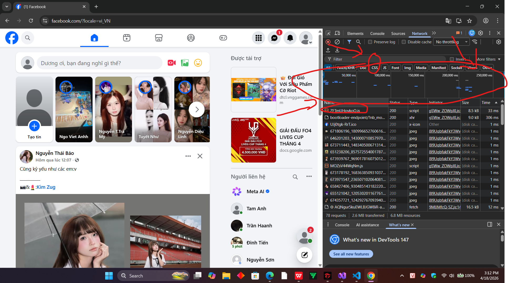
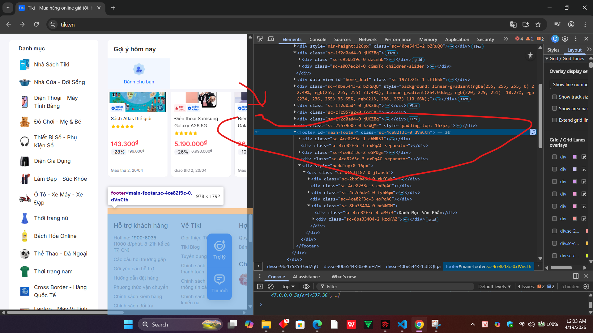
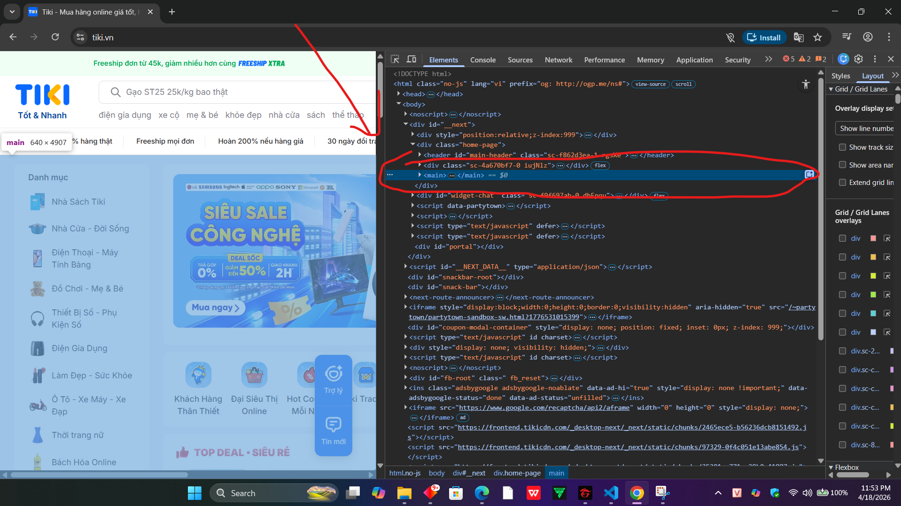
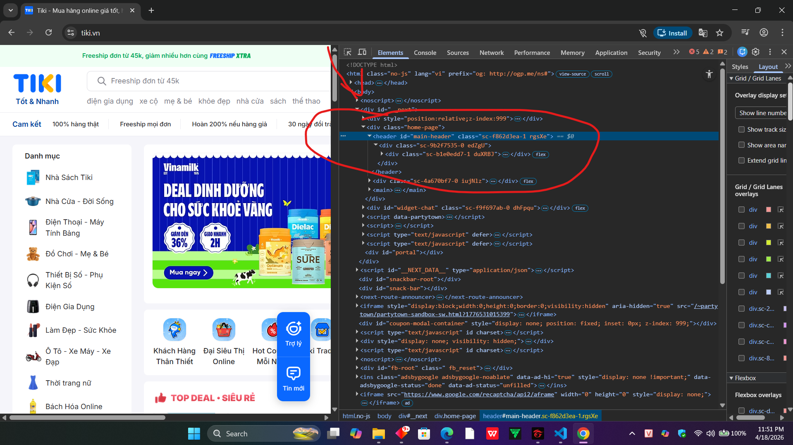
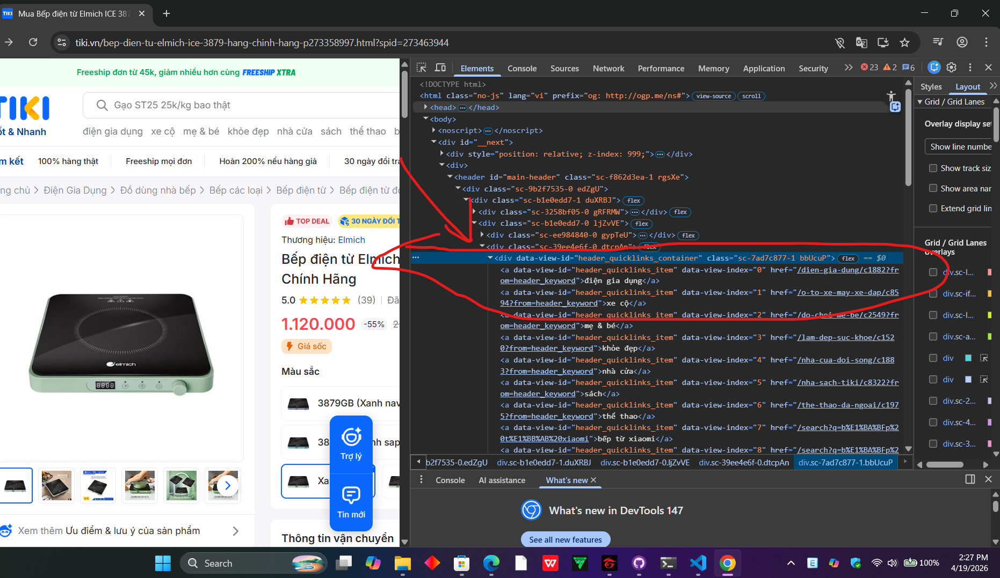

//---//PHẦN A
Câu A1 (5đ) — HTTP & Browser
Đọc chương 01 (01_introduction_html_universe.md), trả lời:

1. Khi bạn gõ https://shopee.vn vào trình duyệt và nhấn Enter, hãy liệt kê đúng thứ tự ít nhất 5 bước xảy ra (từ DNS lookup đến render).
    Bước 1: DNS Lookup (Tra cứu DNS)  
    Request từ laptop → router WiFi → nhà mạng VNPT → hệ thống DNS để tìm địa chỉ IP của shopee.vn.
    Bước 2: TCP Handshake (Thiết lập kết nối TCP)  
    Sau khi có IP, Chrome bắt tay 3 bước với server Shopee (SYN → SYN-ACK → ACK) để mở kênh truyền dữ liệu.
    Bước 3: TLS/SSL Handshake (Kết nối bảo mật HTTPS)  
    Chrome và server Shopee trao đổi chứng chỉ SSL/TLS để mã hóa dữ liệu, đảm bảo an toàn khi truyền thông tin.
    Bước 4: HTTP Request/Response (Gửi và nhận dữ liệu)  
    Chrome gửi HTTP GET request: “Minh muốn xem trang chủ Shopee” → Server Shopee xử lý và trả về HTML, CSS, JS, hình ảnh sản phẩm.
    Bước 5: Rendering (Trình duyệt dựng trang)  
    Chrome nhận response → phân tích HTML, áp dụng CSS, chạy JavaScript → render giao diện Shopee với banner khuyến mãi và sản phẩm nổi bật.

2. Trong DevTools của Chrome, tab Network cho thấy thông tin gì? Hãy mở một trang web bất kỳ, chụp screenshot tab Network và đánh dấu (vẽ mũi tên/khoanh tròn) vào:

Status Code của request đầu tiên
Tổng thời gian load trang
Một request trả về file CSS

ảnh image_A1.png

Câu A2 (5đ) — Semantic HTML
Đọc chương 04, trả lời: Tại sao trang web dưới đây bị Google đánh giá SEO thấp? Liệt kê ít nhất 4 lỗi semantic và sửa lại.

    
ShopTLU

    

        
<a href="/">Trang chủ</a>

        
<a href="/products">Sản phẩm</a>

    

    

        
iPhone 16 Pro

        
25.990.000đ

        

    

© 2026 ShopTLU

1. Sử dụng thẻ 
 cho các thành phần cấu trúc chính
2. Thiếu các thẻ tiêu đề (Header)
3. Thiếu thẻ điều hướng(nav)
4. Thiếu thẻ Phần cuối  (footer)

sửa lại:
<header>
    
ShopTLU

    <nav class="menu">
        
<a href="/">Trang chủ</a>

        
<a href="/products">Sản phẩm</a>

    </nav>
</header>
<main>
    <article class="product">
        
iPhone 16 Pro

        
25.990.000đ

        <figure class="image"></figure>
        <figcaption>iPhone 16 Pro - 25.990.000đ</figcaption>
    </article>
</main>
<footer>© 2026 ShopTLU</footer>

tuan_1_html5/04_visible_part_html.md

Câu A3 (5đ) — Block vs Inline

    tuan_1_html5/04_visible_part_html.md

    Không chạy code, hãy vẽ tay (hoặc mô tả bằng text art) kết quả hiển thị của đoạn HTML sau. Giải thích tại sao.

    
Hộp 1

    Text A
    Text B
    
Hộp 2

    Text C
    <strong>Text D</strong>
    
Hộp 3

    Mô tả :
    Hộp 1-----------------------
    text A text B---------------
    Hộp 2-----------------------
    text C text D---------------
    Hộp 3-----------------------

Câu A4 (5đ) — Table
    Đọc chương 05. Giải thích sự khác nhau giữa <thead>, <tbody>, <tfoot>. Tại sao KHÔNG NÊN dùng table để tạo layout trang web? (Ghi rõ ít nhất 3 lý do)
    Thẻ 	Vai trò	    ghi chú
    <thead>	Header	    Tiêu đề cột
    <tbody>	Body	    Dữ liệu chính
    <tfoot>	Footer	    Tổng kết
    tuan_1_html5/05_tables_hyperlinks.md

    - Lý do 1: Sai lệch về mặt Ngữ nghĩa (Semantic Error)
    Thẻ <table> được sinh ra chỉ để hiển thị dữ liệu dạng bảng (tabular data). Nếu dùng nó để làm layout, các công cụ tìm kiếm (Google) sẽ hiểu nhầm trang web của bạn là một tập tài liệu dữ liệu khô khan thay vì một trang web có cấu trúc. Điều này gây hại nghiêm trọng cho SEO.

    - Lý do 2: Không linh hoạt với thiết kế di động (Responsive)
    Bảng có cấu trúc rất cứng nhắc. Việc co giãn một hệ thống bảng phức tạp để hiển thị đẹp trên điện thoại là cực kỳ khó khăn. Trong khi đó, các công cụ hiện đại như Flexbox hay CSS Grid cho phép thay đổi vị trí các phần tử cực kỳ linh hoạt mà không cần sửa mã HTML.

    - Lý do 3: Tốc độ tải trang và Hiệu suất render
    Trình duyệt thường phải tải xong toàn bộ nội dung bên trong cặp thẻ <table> thì mới bắt đầu tính toán kích thước và hiển thị ra màn hình. Nếu trang web của bạn dài, người dùng sẽ thấy một màn hình trắng trong thời gian đợi bảng tải xong. Ngược lại, layout bằng thẻ 
 kết hợp CSS sẽ giúp nội dung hiện ra ngay khi từng phần được tải về.
//----//Phần B

--Bài B3 (15đ) — Debug HTML
    File HTML dưới đây có ít nhất 10 lỗi (cả syntax lẫn semantic). Tìm và sửa TẤT CẢ.
    Tạo file debug.html cho bản sửa. Trong answers.md, liệt kê từng lỗi theo format:

    Lỗi 1: Dòng 1 — Mô tả lỗi: lỗi khai báo thiếu html5 — Cách sửa : thêm từ khóa html vào trong thẻ 

    Lỗi 2: Dòng 2 — Mô tả lỗi: Thẻ html chưa có thuộc tính ngôn ngữ tiếng việt nên không sử dụng được ngôn ngữ tiếng việt — Cách sửa: thêm lang=:"vi"

    Lỗi 3: Dòng 5 — Mô tả lỗi: định dạng charset không đúng — Cách sửa: charset="utf-8"

    Lỗi 4: Dòng 4 — Mô tả lỗi: chưa đóng thẻ title — Cách sửa: 
    thêm </tile>

    Lỗi 5: Dòng 8 — Mô tả lỗi: đóng thẻ <h1> không đúng — Cách sửa: sửa lại <h1> ở cuối thành </h1>

    Lỗi 6: Dòng 12 — Mô tả lỗi: đóng thẻ <a> không đúng— Cách sửa:
    sửa lại <a> ở cuối thành </a>

    Lỗi 7: Dòng 12,13 — Mô tả lỗi: thuộc tính href ghi chưa đúng , thiếu dấu # đằng trước chuỗi — Cách sửa:
                <a href="#home">Trang chủ</a>
                <a href="#products">Sản phẩm</a>
    lỗi 8: dòng 19,26 -Mô tả lỗi: sau tab <h1> phải là <h2>- cách sửa đổi <h3> thành <h2>
    Lỗi 8: Dòng 20 — Mô tả lỗi: thuộc tính src phải để trong dấu "" — Cách sửa:            
                
    Lỗi 9: Dòng  22— Mô tả lỗi: thứ tự đóng thẻ không đúng , đây là giá tiền nên phải để trong thẻ strong— Cách sửa:
                đổi thẻ <b> thành thẻ <strong> và đóng thẻ đúng thứ tự
                
Giá: <strong>25.990.000đ</strong>

    Lỗi 10: Dòng 28,31 — Mô tả lỗi:lỗi semantic việc thiếu các thẻ phân vùng chức năng (<thead>, <tbody>, <tfoot>) không làm bảng bị lỗi hiển thị, nhưng nó làm giảm tính ngữ nghĩa (Semantic) và gây khó khăn cho các trình đọc màn hình — Cách sửa: thêm thẻ <thead> và thẻ đóng </thead>

    Lỗi 11: Dòng 29,30 — Mô tả lỗi: lỗi semantic ở thẻ <thead> trong thẻ <tr> là thẻ <th> — Cách sửa: đổi <td> thành <th>

    Lỗi 12: Dòng 32,35 — Mô tả lỗi:lỗi semantic việc thiếu các thẻ phân vùng chức năng (<thead>, <tbody>, <tfoot>) không làm bảng bị lỗi hiển thị, nhưng nó làm giảm tính ngữ nghĩa (Semantic) và gây khó khăn cho các trình đọc màn hình — Cách sửa: thêm thẻ <tbody> và thẻ đóng </tbody>

    Lỗi 13: Dòng 40,42  — Mô tả lỗi: lỗi semantic trong thẻ body không được chứa 2 thẻ <main> — Cách sửa: đổi thẻ <main> thành thẻ phù hợp <aside>

    Lỗi 14: Dòng 44 — Mô tả lỗi: lỗi syntax thiếu đóng thẻ  thiếu kí tự bản quyền — Cách sửa: sửa thành
            
&copy;Copyright 2026

    Lỗi 15: Dòng 46 — Mô tả lỗi: lỗi syntax thiếu đóng thẻ <html> — Cách sửa: thêm đóng thẻ </html>

---Bài B4 (15đ) — Phân tích trang web thật
        Chọn 1 trong 3 trang web sau: tiki.vn, shopee.vn, thegioididong.com
        Sử dụng DevTools (F12):

    1.1--Chụp screenshot tab Elements, chỉ ra ít nhất:
    3 thẻ semantic HTML5 mà trang đó sử dụng (ghi rõ thẻ gì, ở đâu)
        1.Thẻ footer
            Vị trí: Nằm ở dưới cùng của trang web.
            Nội dung bên trong:chứa nội dung thông tin liên hệ tiki, danh mục hàng hóa,...
            
        2. thẻ main
            Vị trí: Nằm ở ngay trên cùng của trang web.
            Nội dung bên trong:chứa nội dung của trang web, danh mục hàng hóa,...
            
        3. thẻ header
            Vị trí: Nằm ở ngay trên cùng của trang web.
            Nội dung bên trong:chứa Logo của trang web, thanh tìm kiếm (Search bar),...
            

    1.2--thẻ mà trang đó KHÔNG dùng đúng semantic (nếu có)
        thẻ div
            

2---Mở tab Elements, tìm 1 <table> trên trang. Chụp screenshot và trả lời:

    Table đó hiển thị nội dung gì?
    Có dùng <thead>, <tbody> không?

    -- em chưa tìm thấy được thẻ table

    Tìm 1 <form> trên trang (ví dụ ô tìm kiếm). Chụp screenshot:
    do trang tiki.vn không có thẻ form nên em xin phép xử dụng thẻ form ở trên trang thegioididong.com
    Form đó có action và method gì?
        form đó có action tim-kiem và method =...
    Input types nào được dùng?
    input type = "text"

//---//Phần C
Câu C1 (10đ) — Thiết kế cấu trúc
Bạn được giao thiết kế cấu trúc HTML cho trang chi tiết sản phẩm (giống trang sản phẩm Shopee/Tiki). Trang bao gồm:

Header + Navigation
Breadcrumb (Trang chủ > Điện thoại > iPhone 16)
Khu vực ảnh sản phẩm (5 ảnh)
Thông tin sản phẩm (tên, giá, đánh giá sao, mô tả)
Bảng thông số kỹ thuật
Khu vực đánh giá/bình luận
Sidebar: Sản phẩm tương tự
Footer
Yêu cầu: Viết chỉ phần cấu trúc HTML (không cần nội dung thật, chỉ cần đúng thẻ và nesting). Mỗi thẻ phải có comment giải thích tại sao bạn chọn thẻ đó.

Header + Navigation
<header>
    <nav>
        <ul>
            <li><a href="/">Trang chủ</a></li>
        </ul>
    </nav>
</header>
    Lý do : chọn thẻ <header> để định danh nội dung ở đầu trang,
            chọn thẻ <nav> để định danh là nội dung điều hướng, liên kết ,
            chọn thẻ <ul> để định danh là danh sách không có thứ tự gồm các thành phần bằng thẻ <li>.

Breadcrumb (Trang chủ > Điện thoại > iPhone 16)
<nav aria-label="Breadcrumb">
        <ol>
            <li><a href="#">Trang chủ</a></li>
            <li><a href="#">Điện thoại</a></li>
            <li>iPhone 16</li>
        </ol>
</nav>
        Chọn thẻ <nav> để định danh đây là khu vực chứa các liên kết điều hướng vị trí.
        Chọn thẻ <ol> để định danh là danh sách có thứ tự, vì Breadcrumb thể hiện cấp bậc từ lớn đến nhỏ theo một trình tự nhất định.
        Chọn thẻ <li> để đại diện cho từng cấp bậc trong sơ đồ đường dẫn.

Khu vực ảnh sản phẩm (5 ảnh)
<section calss ="products">
    <figure>
        
        
        
                
        
        <figcaption>Iphone 16</figcaption>
    <figure>
</section>
    Chọn thẻ <section> để định danh một vùng nội dung riêng biệt chứa các tài liệu hình ảnh của sản phẩm.
    Chọn thẻ <figure> để nhóm các tấm ảnh có liên quan chặt chẽ với nhau thành một khối minh họa.
    Chọn thẻ  để nhúng các tệp ảnh vào trang web.
    Chọn thẻ <figcaption> để cung cấp lời chú thích hoặc tiêu đề cho nhóm hình ảnh nằm trong figure.

Thông tin sản phẩm (tên, giá, đánh giá sao, mô tả)
<article class="product-info">
                <h2>Tên sản phẩm: iPhone 16</h2>
                
Giá: 22.990.000đ

                
Đánh giá: 5/5 sao

                
Mô tả tóm tắt sản phẩm...

</article>
    Chọn thẻ <article> để định danh đây là một khối nội dung độc lập, có ý nghĩa trọn vẹn (thông tin chính của sản phẩm) mà không cần phụ thuộc vào các phần khác.
    Chọn các thẻ <h2>, 
, 
 để phân cấp thông tin từ tiêu đề tên sản phẩm đến các chi tiết giá và mô tả.
    Bảng thông số kỹ thuật
<section class="product-specs">
    <h3>Thông số kỹ thuật</h3>
    <table>
        <thead>
            <tr>
                <th>Đặc tính</th>
                <th>Thông số</th>
            </tr>
        </thead>
        <tbody>
            <tr>
                <td>Màn hình</td>
                <td>6.1 inch, OLED</td>
            </tr>
            <tr>
                <td>Chip</td>
                <td>A18 Bionic</td>
            </tr>
        </tbody>
    </table>
</section>
    Chọn thẻ <section> để tách biệt khu vực thông số kỹ thuật thành một phân đoạn riêng.
    Chọn thẻ <table> để định danh dữ liệu được trình bày dưới dạng bảng (hàng và cột).
    Chọn thẻ <thead> và <tbody> để phân chia rõ ràng giữa phần tiêu đề bảng và phần nội dung dữ liệu, giúp trình duyệt tối ưu hóa hiển thị.

Khu vực đánh giá/bình luận
<section class="customer-reviews">
    <h3>Đánh giá từ khách hàng</h3>
    <article>
        <h4>Nguyễn Văn A</h4>
        
Máy dùng rất mượt, giao hàng nhanh.

    </article>
</section>

Sidebar: Sản phẩm tương tự
<aside>
        <h3>Sản phẩm tương tự</h3>
        <ul>
            <li>iPhone 15</li>
            <li>iPhone 16 Pro</li>
            <li>Samsung S24</li>
        </ul>
</aside>
    Chọn thẻ <aside> để định danh đây là nội dung phụ, liên quan gián tiếp đến sản phẩm chính đang xem (thường đặt ở cột bên cạnh).
    Chọn thẻ <ul> để liệt kê danh sách các sản phẩm gợi ý một cách trực quan.

Footer
<footer>
    
&copy; 2026 - Cửa hàng điện thoại của Hiên

</footer>
    Chọn thẻ <footer> để định danh nội dung ở cuối trang, chứa các thông tin về bản quyền, chính sách hoặc thông tin liên hệ của cửa hàng.

Câu C2 (10đ) — So sánh & Tranh luận
Một đồng nghiệp nói: "Dùng 
 cho mọi thứ rồi thêm class là được, không cần semantic HTML. Tốn thời gian học thêm thẻ mới."

Viết 1 đoạn phản biện (200-300 từ), phải bao gồm:

Ít nhất 2 lý do kỹ thuật (SEO, Accessibility)
1 ví dụ cụ thể chứng minh semantic HTML giúp ích
1 trường hợp thực tế mà 
 vẫn phù hợp

bài làm

Việc dùng mọi thứ rồi thêm class là được, không cần senmantic html. Quan điểm đó là một sai lầm chí mạng trong quá trình thiết kế, phát triển web.
Thứ nhất về mặt kỹ thuật SEO ,google không chỉ đọc nội dung mà phân tích cấu trúc trang web, một trang web khi được viết hoàn toàn bằng thẻ 

- là một thẻ phi ngữ nghĩa, được định nghĩa thủ công nên SEO không phân tích được nhận dạng vai trò của nó, ngược lại một trang web sử dụng thêm semantic html 
giúp google hiểu rõ mục đích của từng thẻ có vai trò gì. Thứ hai là Accessibility (khả năng truy cập): các công cụ hỗ trợ dựa vào semantic HTML để hiểu cấu trúc web giúp chúng tương thích và phát huy tối đa khả năng tiếp cận cho nhiều người dùng hơn so với thẻ 
. Ví dụ chứng minh semantic HTML giúp ích:
một trang web nếu dùng <header> cho phần đầu và <nav> đánh dấu phần điều hướng, thì SEO sẽ hiểu và các công cụ hỗ trợ tiếp cận hiểu rõ phần này là phần điều hướng và ở đầu trang dùng để chuyển hướng sang các trang khác. 1 trường hợp thực tế mà 
 vẫn phù hợp : Khi thiết kế một block sản phẩm có nhiều thẻ ,<h3><article> việc gom chúng lại ở trên thẻ 
 là hoàn toàn được và phù hợp để phát triển đa dạng về mặt thiết kế. 

