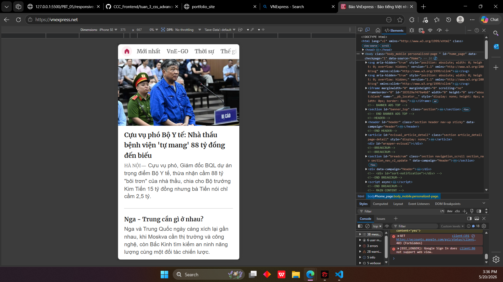
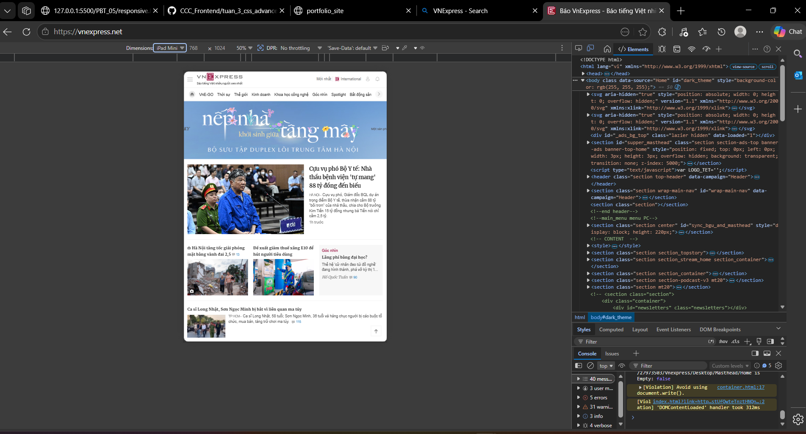
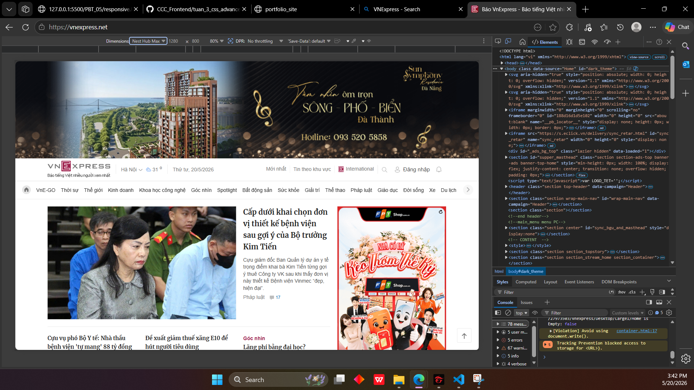
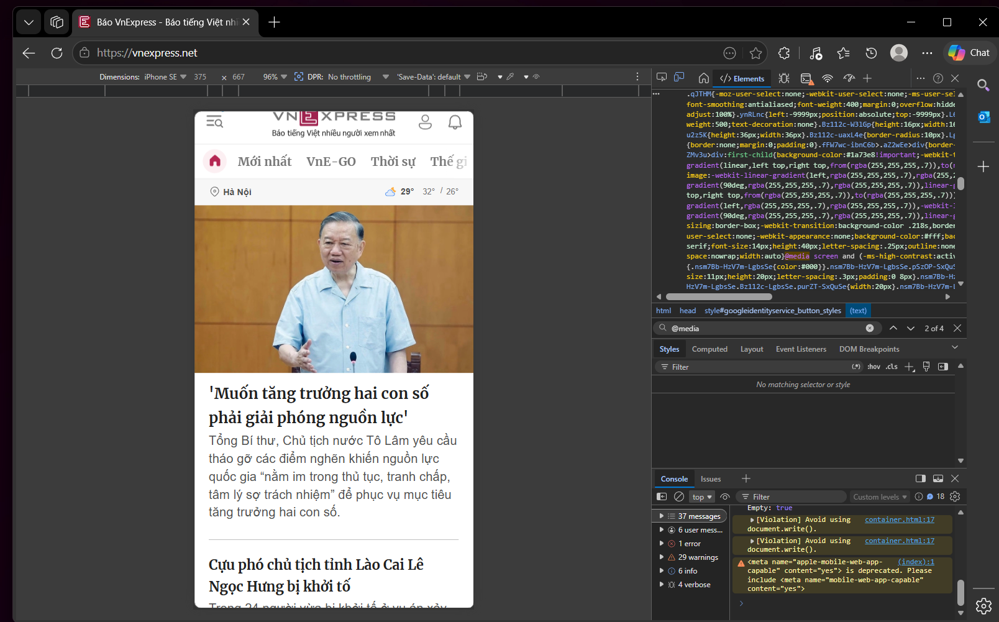
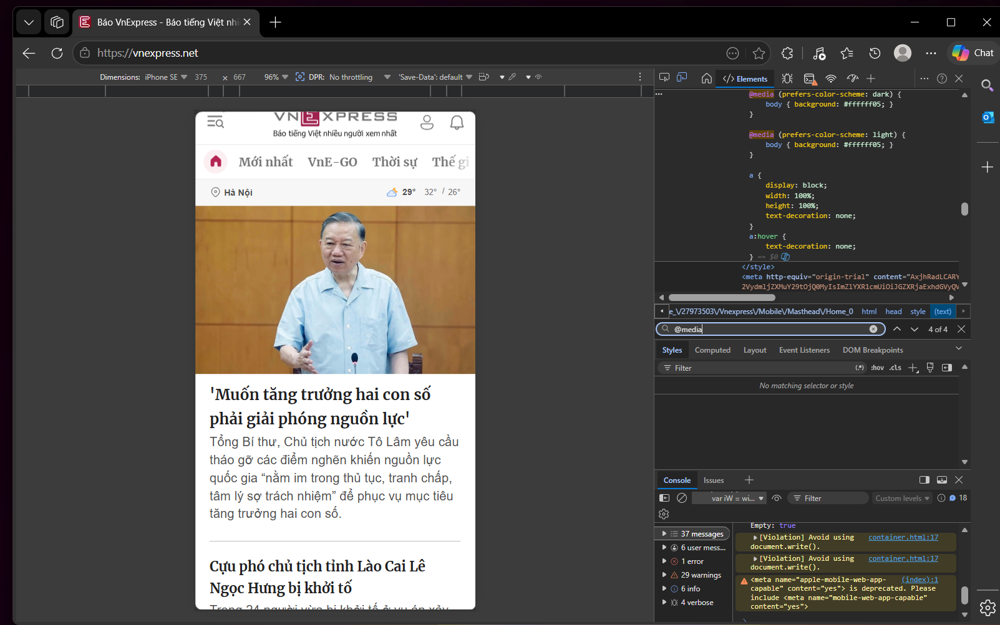

### Câu A1 (5đ) — Viewport & Mobile-First

1. Viết chính xác thẻ <meta viewport> chuẩn. Giải thích từng thuộc tính.
    <!-- <meta name="viewport" content="width=device-width,initial-scale=1.0"> -->
    name=viewport khai báo rằng thẻ này dùng để thiết lập khung hình viewport nội dung hiển thị trang web thiết bị
    content="" nơi chứa tham số cấu hình cụ thể của khung hình
    width=device-width thiết lập chiều rộng viewport bằng chiều rộng thiết bị
    inital-scale=1.0 thiết lập mức độ phosg to thu nhỏ ban đầu trang wen là 100%
2. Nếu THIẾU thẻ này, iPhone sẽ hiển thị trang web như thế nào? (Đọc chương 13)
Mobile-First và Desktop-First khác nhau thế nào? Viết ví dụ CSS cho mỗi cách với breakpoint 768px. Tại sao Mobile-First được khuyên dùng?
    Thiếu dòng này: iPhone giả định trang rộng 980px (như desktop) → thu nhỏ lại → chữ bé xíu → UX tệ.
    Có dòng này: iPhone dùng chiều rộng thật của màn hình (375px) → chữ đúng kích thước → readable.
3. Mobile-First và Desktop-First khác nhau thế nào? Viết ví dụ CSS cho mỗi cách với breakpoint 768px. Tại sao Mobile-First được khuyên dùng?
    mobile-first : code cho mobile trước và @media cho desktop sau
    desktop-first : tương tự
    VD:

    mobile-first:
    .container{
        display: grid;
        grid-template-columns: 1fr;     /* 1 cột trên mobile */
        gap: 16px;
    }
    @media (min-width:768px)
    {
        .container{
            grid-template-columns: 2fr;     /* 1 cột trên mobile */
        }
    }
    desktop-first
    .container{
        display: grid;
        grid-template-columns: 2fr;     /* 1 cột trên mobile */
        gap: 16px;
    }
    @media (max-width:768px)
    {
        .container{
            grid-template-columns: 1fr;     /* 1 cột trên mobile */
        }
    }
    Lý do Mobile-First tốt hơn:
    Mobile tải ít CSS hơn (mobile chỉ tải mobile styles, không download desktop styles)
    Buộc bạn ưu tiên nội dung quan trọng trước (content thinking)
    Google và performance tools đánh giá cao hơn
###    Câu A2 (5đ) — Breakpoints
    Ghi lại breakpoints chuẩn (theo tài liệu hoặc Bootstrap). Cho mỗi breakpoint:
    Tên	        Min-width	Thiết bị điển hình
    Mobile	    < 576px	    iPhone SE, các điện thoại nhỏ
    Mobile L	≥ 576px	    iPhone Plus, điện thoại ngang
    Tablet	    ≥ 768px	    iPad dọc, tablet
    Desktop	    ≥ 992px	    Laptop nhỏ
    Desktop L	≥ 1200px	Desktop, laptop lớn
    Desktop XL	≥ 1400px	Màn hình 4K, ultrawide

### Câu A3 (5đ) — Media Queries
Đọc CSS sau, cho biết ở mỗi kích thước màn hình, .container có width bao nhiêu? Điền bảng.
.container { width: 100%; padding: 10px; }

@media (min-width: 576px) { .container { width: 540px; } }
@media (min-width: 768px) { .container { width: 720px; } }
@media (min-width: 992px) { .container { width: 960px; } }
@media (min-width: 1200px) { .container { width: 1140px; } }

Chiều rộng màn hình	    .container width
    375px (iPhone SE)	    100%
    600px	                540px
    800px	                720px
    1000px	                960px
    1400px	                1140px

### Câu A4 (5đ) — SCSS Basics
Đọc chương 16. Giải thích 4 tính năng chính của SCSS và cho ví dụ:

Variables ($primary-color)
    variables cho phép sử dụng nhiều lần theo tên biến mà chỉnh sửa chỉ cần 1 nơi duy nhất
    $primary-color: #3498db;
    $padding-main: 20px;
    .button {
        background-color: $primary-color;
        padding: $padding-main;
    }
Nesting (viết CSS lồng nhau)
    CSS theo cấu trúc HTML
    vd
    .navbar {
        background: #1a202c;
        padding: $space-4;
        display: flex;
        align-items: center;
        justify-content: space-between;

        // & = tham chiếu đến selector cha (.navbar)
        &__logo {
            color: white;
            font-size: $font-size-lg;
            font-weight: 700;
            text-decoration: none;
        }
    }
    ở css đọc là
    .navbar_logo{
        background: #1a202c; padding: 16px; display: flex; ...
    }

Mixins (@mixin, @include)
    Hàm CSS tái sử dụng
    khai báo mixin
    @mixin flex-center {
        display: flex;
        justify-content: center;
        align-items: center;
    }
    và sử dụng tái sử dụng @ include
    .modal {
        @include flex-center;
        position: fixed;
        inset: 0;
    }
@extend / Inheritance
    Cho phép một selector thừa hưởng toàn bộ các thuộc tính của một selector khác. Điều này giúp giảm thiểu việc lặp lại code (DRY - Don't Repeat Yourself)
    .message-shared {
    border: 1px solid #ccc;
    padding: 10px;
    color: #333;
    }

    .success {
    @extend .message-shared;
    border-color: green;
    }

    .error {
    @extend .message-shared;
    border-color: red;
}
Tại sao trình duyệt KHÔNG đọc được file .scss? Cần bước gì để chuyển SCSS → CSS?
    Trình duyệt (Chrome, Firefox, Safari...) được thiết kế để chỉ hiểu và thông dịch các tiêu chuẩn web cơ bản là HTML, CSS và JavaScript.
    Bước cần thiết để chuyển SCSS → CSS
    Để đưa vào sản phẩm thực tế, bạn cần một bước gọi là Biên dịch (Compilation):
    1.Cài đặt trình biên dịch: Sử dụng các công cụ như Sass (Dart Sass), hoặc các extension trong VS Code (như Live Sass Compiler).
    2.Quá trình Compile: Trình biên dịch sẽ quét file .scss, xử lý tất cả các biến, mixin, nesting... và "duỗi thẳng" chúng ra thành mã CSS chuẩn.
    3.Kết nối: Bạn sẽ nhúng file .css (kết quả sau khi compile) vào file HTML của mình.

PHẦN C — PHÂN TÍCH (20 điểm)
### Câu C1 (10đ) — Phân tích trang web thực
## Minh họa giao diện Responsive

### 📱 Giao diện Mobile


navigation hamburger
Lưới content 1 cột
Các phần tử a,button,sidebar tìm kiếm ẩn trên mobile
font-size giảm nhẹ và line-heigh tăng nhẹ để chữ dễ đọc
### 📟 Giao diện Tablet


### 💻 Giao diện Desktop


3. Mở DevTools → Styles, tìm @media rules. Chụp screenshot ít nhất 2 media queries trang đó dùng.

### Câu C2 (10đ) — Thiết kế Responsive Strategy
Bạn được giao thiết kế trang Đặt bàn nhà hàng responsive. Trang có:

Header với logo + điện thoại đặt bàn
Hero image toàn trang
Grid 6 ảnh món ăn
Form đặt bàn (ngày, giờ, số người, ghi chú)
Bản đồ Google Maps nhúng
Footer
    Yêu cầu: Vẽ wireframe (sơ đồ bố cục) cho 3 kích thước: Mobile, Tablet, Desktop.
-moblie :
+-----------------------------------+
| [Logo]                        [☰] |  <-- Header (Gom Hotline vào Menu)
+-----------------------------------+
|                                   |
|            HERO IMAGE             |  <-- Chiếm toàn chiều ngang
|                                   |
+-----------------------------------+
|         FORM ĐẶT BÀN              |
| [ Ngày / Giờ ]                    |  <-- Các ô input xếp dọc
| [ Số người ]                      |
| [ Ghi chú... ]                    |
| [ ĐẶT BÀN NGAY ]                  |
+-----------------------------------+
| GRID MÓN ĂN (1 Cột - Hiện 3 ảnh)  |
| +-------------------------------+ |
| |          [Ảnh món 1]          | |
| +-------------------------------+ |
| |          [Ảnh món 2]          | |
| +-------------------------------+ |
| |          [Ảnh món 3]          | |
| +-------------------------------+ |
+-----------------------------------+
|                                   |
|         GOOGLE MAPS (Ẩn bớt)      |  <-- Thu nhỏ chiều cao bản đồ
|                                   |
+-----------------------------------+
|             FOOTER                |  <-- Xếp dọc thông tin
+-----------------------------------+

-tablet:
+-------------------------------------------------------+
| [Logo]                                  Hotline: 1900 |  <-- Header hiện Hotline
+-------------------------------------------------------+
|                                                       |
|                      HERO IMAGE                       |
|                                                       |
+-------------------------------------------------------+
|                     FORM ĐẶT BÀN                      |
| [ Ngày / Giờ ]  [ Số người ]  [ Ghi chú ]  [ BUTTON ] |  <-- Gom thành 2 cột/hàng ngang
+-------------------------------------------------------+
| GRID MÓN ĂN (2 Cột x 3 Hàng)                          |
| +--------------------------+ +--------------------------+ |
| |       [Ảnh món 1]        | |       [Ảnh món 2]        | |
| +--------------------------+ +--------------------------+ |
| |       [Ảnh món 3]        | |       [Ảnh món 4]        | |
| +--------------------------+ +--------------------------+ |
| |       [Ảnh món 5]        | |       [Ảnh món 6]        | |
| +--------------------------+ +--------------------------+ |
+-------------------------------------------------------+
|                                                       |
|                      GOOGLE MAPS                      |  <-- Bản đồ tràn ngang rộng rãi
|                                                       |
+-------------------------------------------------------+
|                        FOOTER                         |
+-------------------------------------------------------+
- desktop:
+-------------------------------------------------------------------+
| [Logo]            [Trang chủ]  [Thực đơn]  [Liên hệ]  Hotline: 1900 | <-- Header đầy đủ
+-------------------------------------------------------------------+
|                                                                   |
|                            HERO IMAGE                             |
|                                                                   |
+-------------------------------------------------------------------+
| CỘT TRÁI: NỘI DUNG CHÍNH (65%)     | CỘT PHẢI: SIDEBAR (35%)      |
|                                    |                              |
| GRID MÓN ĂN (3 Cột x 2 Hàng)       | +--------------------------+ |
| +---------+ +---------+ +---------+ | |       FORM ĐẶT BÀN       | |
| | [Món 1] | | [Món 2] | | [Món 3] | | |                          | |
| +---------+ +---------+ +---------+ | | [Ngày]       [Giờ]       | |
| | [Món 4] | | [Món 5] | | [Món 6] | | | [Số người]               | |
| +---------+ +---------+ +---------+ | | [Ghi chú]                | |
|                                    | |                          | |
| GOOGLE MAPS                        | |      [ ĐẶT BÀN NGAY ]    | |
| +--------------------------------+ | +--------------------------+ |
| |                                | |                              |
| |          [Bản đồ nhúng]        | |                              |
| |                                | |                              |
| +--------------------------------+ |                              |
+-------------------------------------------------------------------+
|                              FOOTER                               |
+-------------------------------------------------------------------+
    Mobile: Những gì bị ẩn? Form nằm đâu?
    header sdt đặt bàn, các nav a, sidebar đặt bàn bị ẩn
    Tablet: Grid ảnh mấy cột? Bản đồ nằm đâu?
    2 cột goodle map nằm ở dưới món ăn
    Desktop: Layout bao nhiêu cột? Sidebar có không?
    layout có 2 cột 
    Viết CSS skeleton (chỉ layout, không cần chi tiết) dùng Grid + Media Queries Mobile-First.
    ```
    <div class="restaurant-layout">
    <header class="header">Header (Logo + Hotline)</header>
    <section class="hero">Hero Image</section>
    <main class="main-content">
        <section class="menu-grid">Grid 6 ảnh món ăn</section>
        <section class="maps">Google Maps</section>
    </main>
    <aside class="sidebar-form">Form đặt bàn</aside>
    <footer class="footer">Footer</footer>
    </div>
```
```
    .restaurant-layout {
    display: grid;
    grid-template-columns: 1fr;
    }

    .header {
        display: flex;
        justify-content: space-between;
        align-items: center;
    }

    .header .hotline,
    .header nav {
    display: none; 
    }

    .hero {
        width: 100%;
        height: auto;
    }

    .sidebar-form {
        display: block;
    }

    .menu-grid {
        display: grid;
        grid-template-columns: 1fr;
        gap: 15px;
    }

    .menu-grid .menu-item:nth-child(n+4) {
        display: none;
    }

    .maps {
        width: 100%;
    }

    @media screen and (min-width: 768px) {
    .header .hotline {
        display: block;
    }

    .menu-grid {
        grid-template-columns: repeat(2, 1fr);
    }

    .menu-grid .menu-item:nth-child(n+4) {
        display: block;
    }
    }

    @media screen and (min-width: 1440px) {
    .header nav {
        display: flex;
        gap: 20px;
    }

    .restaurant-layout {
        grid-template-columns: 65% 35%;
        grid-template-areas:
        "header  header"
        "hero    hero"
        "main    sidebar"
        "footer  footer";
        gap: 30px;
    }

    .header       { grid-area: header; }
    .hero         { grid-area: hero; }
    .main-content { grid-area: main; }
    .sidebar-form { grid-area: sidebar; }
    .footer       { grid-area: footer; }

    .menu-grid {
        grid-template-columns: repeat(3, 1fr);
    }

    .sidebar-form {
        position: sticky;
        top: 20px;
        height: max-content;
    }
    }
    ```

